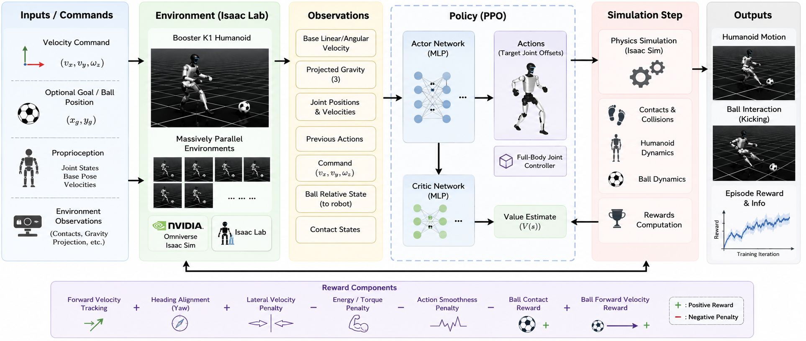

# CS498 Robotics Team Project: RL for Humanoid Walking-to-Kicking

Team 2 final project repository for **CS 498 Robotics Team Project, Spring 2026**.

This project investigates reinforcement learning for humanoid walking and soccer-style kicking using the Booster K1 humanoid robot in Isaac Lab / Isaac Sim.

## System Overview

**Figure 1.** Overview of the Isaac Lab reinforcement learning pipeline for Booster K1 walking and soccer-style kicking. The policy receives velocity commands, proprioceptive states, gravity projection, previous actions, and ball-relative information, then outputs target joint offsets for full-body humanoid control. The simulation loop computes contacts, humanoid dynamics, ball dynamics, and reward terms used for PPO training.

## Project Summary

We trained and evaluated walking policies, adapted walking behavior toward kicking, analyzed policy failures, and documented staged training attempts, rollout videos, reward curves, screenshots, and final report materials.

## Main Deliverables

- Final write-up/report
- Final presentation slides
- Isaac Sim / Isaac Lab rollout videos
- Selected Isaac Lab code/configuration files
- Training figures and logs
- Screenshots/contact sheets
- Individual contribution report

## Repository Structure

- `Doc&Slide/`
  - `CS498_Team2_Final_Report.pdf`
  - `robotics_final_presentation_k1_kicking.pptx`
  - `individual_contribution_reports/`
- `code/`
  - `isaac_lab/`
- `videos/`
  - `isaac_sim/`
  - `mujoco/`
- `Screenshots/`
- `final_report_assets/`
  - `figures/`
  - `logs/`
  - `tables/`
  - `k1_fullbody_walk_env_cfg.py`
  - `k1_fullbody_walk_agent_cfg.py`

## Report and Slides

- `Doc&Slide/CS498_Team2_Final_Report.pdf`
- `Doc&Slide/robotics_final_presentation_k1_kicking.pptx`

## Videos

The `videos/` folder contains rollout videos from staged walking and kicking experiments.

- `videos/isaac_sim/` contains Isaac Sim / Isaac Lab rollout videos copied for final submission organization.
- `videos/mujoco/` is kept only for any MuJoCo-related video material, if applicable.
- Existing videos include staged walking/kicking runs and teammate-trained kicking rollout videos.

## Code

The `code/isaac_lab/` folder contains selected Isaac Lab task and PPO configuration files used in the final project.

The full training workspace was developed on the team GPU workstation using Isaac Lab, RSL-RL, and the `booster_train` task package.

## Team Member Contributions

- **Shanshan Zhu:** Designed RL environments, implemented PPO training pipelines, performed reward engineering, conducted training and debugging experiments for both walking and kicking policies, generated evaluation figures, and wrote/organized the report and final submission assets.

- **Aaditya Voruganti:** Contributed to humanoid walking policy development, simulator setup, locomotion evaluation, and experiment analysis.

- **Prithvi Teekaa Murali:** Contributed to kicking-policy development, interaction testing, presentation preparation, and project documentation.

## Notes

Large simulation videos and training artifacts are included for final project review. Some full checkpoints or full workspace files may be omitted if they exceed GitHub file-size or practicality limits. Selected logs, figures, and configuration files are included to document the training process and final results.
